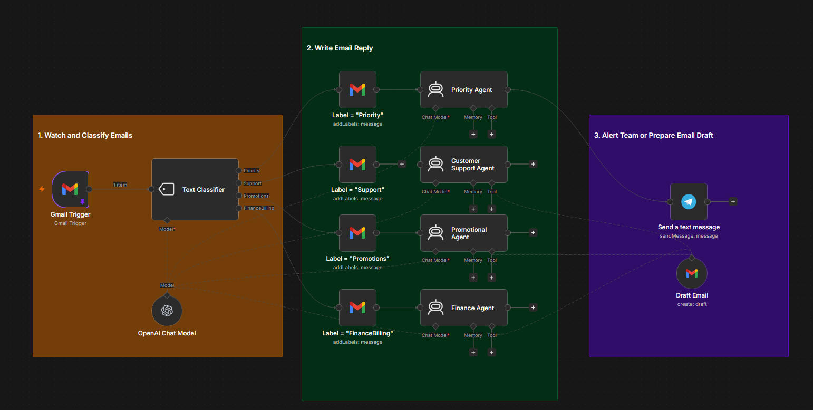
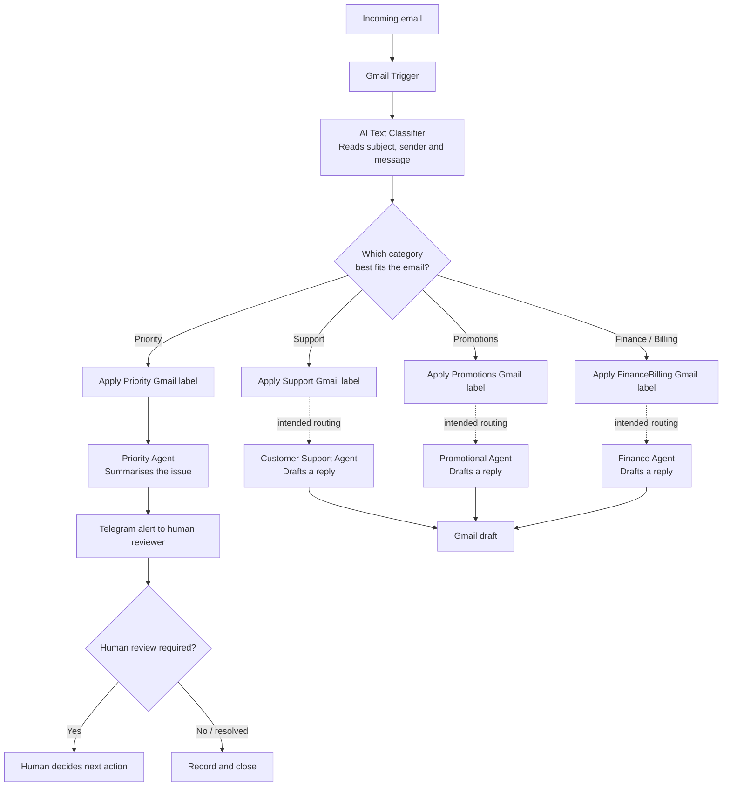

# Smart Inbox Agent

An n8n workflow prototype that turns an incoming-email process into a context-aware decision system. The workflow uses an AI classifier to determine an email category, applies the corresponding Gmail label, and uses specialist AI agents to prepare a response or escalate an urgent case for human attention.

## Project Snapshot

| Item | Details |
| --- | --- |
| **Project type** | AI agent and email-workflow automation |
| **Platform** | n8n |
| **Integrations** | Gmail, OpenAI Chat Model, Telegram |
| **AI model configured** | GPT-4o mini |
| **Human oversight** | Priority cases are summarised and sent to a human through Telegram |

## Goal

Turn a simple email workflow into a decision-making system that can read an incoming email, understand its context, determine the next step, and keep a human involved for high-risk or ambiguous matters.

## Business Problem

Manually reviewing every email can delay responses and make it difficult to identify urgent messages quickly. This prototype explores how AI can assist with triage while retaining human oversight for priority cases.

## Solution

The workflow monitors a Gmail inbox and passes each incoming message to an AI text classifier. The classifier assigns one category—**Priority**, **Support**, **Promotions**, or **Finance/Billing**—then applies the matching Gmail label. Category-specific agents are configured to prepare concise responses or, for priority messages, produce a summary for human review.

## User Flow

Solid lines show the active connections contained in the exported workflow. Dashed lines show the intended routing to the configured specialist agents; these should be connected and tested in n8n before a production deployment.

## Workflow Logic

### 1. Read and classify email

- **Gmail Trigger** watches for incoming messages.
- **OpenAI Chat Model** supplies the language model used by the classifier and agents.
- **Text Classifier** evaluates the email subject, sender, and body, and selects one of four mutually exclusive categories:
  - Priority — urgent issues, deadlines, escalations, or critical business matters
  - Support — customer questions, help requests, complaints, refunds, returns, or service enquiries
  - Promotions — newsletters, campaigns, offers, sales messages, and advertising
  - Finance/Billing — invoices, receipts, payments, subscriptions, refunds, banking, or tax matters

### 2. Take action based on the decision

- The workflow applies the selected Gmail label.
- The **Priority Agent** summarises high-priority messages and sends an alert through Telegram so a person can decide the appropriate follow-up.
- Customer Support, Promotional, and Finance agents are configured to use Gmail’s draft-email capability to create concise response drafts.

### 3. Keep a human in the loop

Urgent messages are not automatically sent as emails. They are surfaced to a human through Telegram with a concise summary, enabling review and judgement before any follow-up action.

## Requirements Coverage

| Requirement | Implementation |
| --- | --- |
| AI node | OpenAI Chat Model, Text Classifier, and specialist AI agents |
| Two or more decision points | AI category classification; human review of priority escalation |
| Two or more actions | Gmail labels, Telegram alert, and Gmail draft-email tool |
| Human-in-the-loop fallback | Priority Agent escalates a summary to a human reviewer through Telegram |

## My Contribution

- Designed an AI-assisted workflow for classifying incoming email by business context.
- Defined category criteria for priority, customer support, promotions, and finance/billing messages.
- Configured Gmail actions to label emails and prepare response drafts.
- Designed a human-escalation path for priority email using Telegram.
- Used prompt instructions to guide agent tone, concise drafting, and priority-case escalation.

## Setup Notes

This project is a learning prototype. To run it in your own n8n environment:

1. Import a **sanitized** copy of the workflow export into n8n.
2. Connect your own Gmail, OpenAI, and Telegram credentials; never commit credentials, API keys, OAuth tokens, email addresses, or chat IDs to GitHub.
3. Create or map Gmail labels for `Priority`, `Support`, `Promotions`, and `FinanceBilling`.
4. Connect and test the Support, Promotions, and Finance/Billing label paths to their respective specialist agents.
5. Test with non-sensitive sample emails before enabling the workflow for a live inbox.

## Current Scope and Next Steps

The exported workflow includes an active Priority-to-Telegram escalation path. The non-priority specialist agents and Gmail draft tool are configured, but the Support, Promotions, and Finance/Billing label paths require final routing connections and end-to-end tests. Suggested enhancements:

- Add confidence thresholds and send low-confidence classifications to human review.
- Add an approval step before a draft becomes a sent response.
- Log classifications, response times, and escalation outcomes for reporting.
- Add sender allowlists, sensitive-data rules, and error notifications.

## Evidence

- [Workflow screenshot](./assets/smart-inbox-agent-workflow.png)
- Sanitized n8n workflow export: to be added after credential references and personal identifiers have been removed.

---

*Built as part of the Elevate University Productivity Engineer Bootcamp. This is a learning prototype and should be tested, secured, and reviewed before production use.*
