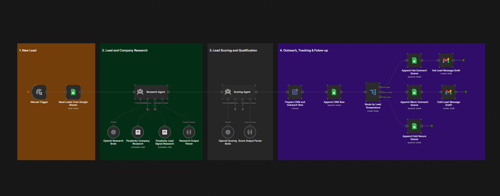
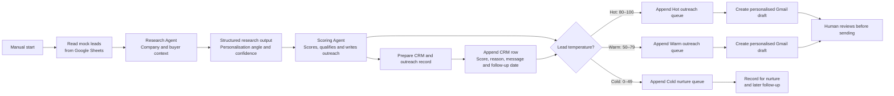

# Lead Generation & Qualification System

An n8n multi-agent workflow prototype that reads lead data, researches company and buyer context, scores each lead, creates personalised outreach drafts, and routes records to the appropriate follow-up queue.

## Project Snapshot

| Item | Details |
| --- | --- |
| **Project type** | AI-assisted lead research, qualification, and outreach automation |
| **Platform** | n8n |
| **Tools** | Google Sheets, OpenAI, Perplexity, Gmail |
| **Input** | Mock lead data stored in Google Sheets |
| **Output** | Lead CRM record, outreach queue, and personalised email draft |

## Goal

Build a coordinated system of agents that can research, analyse, qualify, and prepare outreach for leads—using structured data and clear decision logic rather than a one-size-fits-all message.

## Business Problem

Sales and business-development teams often spend substantial time gathering lead context, deciding who to prioritise, and drafting messages. This prototype demonstrates how AI agents can assist with the early stages of that process while keeping outreach reviewable and based on public or supplied information.

## Solution

The workflow begins with mock lead records in Google Sheets. A Research Agent gathers company and buyer context from the source data and approved public-research tools. A Scoring Agent then evaluates fit, produces a score and temperature, creates a personalised opening message, and assigns follow-up timing. The system records the result in a CRM-style Google Sheet, routes the lead to a Hot, Warm, or Cold queue, and creates Gmail drafts for the active outreach paths.

## User Flow

The diagram shows how lead research feeds a qualification decision and how the selected temperature determines the outreach path and follow-up cadence.

## Agent Logic

### Lead and company research

The **Research Agent** uses the lead record alongside company and lead-signal research tools to produce structured output:

- Company and buyer summaries
- Pain-point-to-offer fit
- A personalisation angle
- A recommended offer
- Research confidence and identified risks

Its instructions explicitly require factual, concise research and prohibit inventing private LinkedIn information.

### Lead qualification and personalisation

The **Scoring Agent** combines the original lead record with the research output. It returns structured fields including:

- Lead score from 0–100
- Temperature: Hot, Warm, or Cold
- Qualification decision and reason
- Personalised initial message
- Follow-up message, timing, and next action

Scoring rules in the workflow classify **80–100** as Hot, **50–79** as Warm, and **0–49** as Cold.

### Outreach and follow-up logic

| Lead type | Workflow action | Follow-up timing |
| --- | --- | --- |
| Hot | Add to the Hot Outreach queue and prepare a Gmail draft | 2 days if there is no reply |
| Warm | Add to the Warm Outreach queue and prepare a Gmail draft | 5 days with softer value proof |
| Cold | Add to the Cold Nurture queue | 14 days with educational content |

The workflow stores the proposed follow-up date and an initial `Pending` response status in the CRM record, allowing subsequent response and follow-up automation to be added.

## Requirements Coverage

| Requirement | How it is addressed |
| --- | --- |
| Find leads | Reads mock leads from Google Sheets; research prompts accept supplied LinkedIn URLs and public context |
| Analyse each lead | Research Agent creates structured company, buyer, fit, and confidence insights |
| Lead qualification decision | Scoring Agent assigns score, qualification status, and Hot/Warm/Cold temperature |
| Personalisation logic | Research output supplies a personalisation angle and recommended offer |
| Message generation | Scoring Agent creates initial and follow-up messages; Gmail nodes create drafts |
| Outreach preparation | Hot and Warm paths append to outreach queues and prepare Gmail drafts |
| Response tracking | CRM row records response status and next follow-up date |
| Follow-up logic | Temperature-specific follow-up windows are configured in the scoring prompt |

## My Contribution

- Designed the multi-agent workflow structure from lead intake through research, qualification, routing, and outreach preparation.
- Defined structured outputs for research quality, confidence, personalisation, lead scoring, and follow-up planning.
- Created qualification rules and Hot/Warm/Cold decision paths.
- Configured Google Sheets as a mock lead source, CRM-style tracker, and outreach queues.
- Prepared personalised email drafts in Gmail rather than automatically sending messages.
- Applied responsible research instructions that limit output to supplied and public information.

## Data and Responsible Use

This portfolio example is designed for **mock data**. Do not upload real personal data, scrape or use data in ways that violate platform terms, or send automated outreach without a lawful basis and appropriate review. Keep consent, privacy, data-minimisation, and anti-spam requirements central to any production implementation.

## Setup Notes

To run a version of this workflow in your own n8n environment:

1. Use mock or approved lead data in a Google Sheet.
2. Connect your own Google Sheets, OpenAI, research-tool, and Gmail credentials.
3. Create sheets for the lead source, CRM record, Hot Outreach, Warm Outreach, and Cold Nurture queues.
4. Test research, scoring, and message quality using sample leads.
5. Keep Gmail in draft mode until a person has reviewed the content and compliance requirements.

## Current Scope and Next Steps

The workflow creates CRM records, routes leads by temperature, and prepares drafts for the Hot and Warm paths. The Cold Nurture path currently records leads for later action. Recommended enhancements include:

- Add a scheduled workflow to check response status and send approved follow-up drafts on the stored follow-up date.
- Add explicit approval and opt-out checks before any outreach is sent.
- Add duplicate detection and contact-frequency limits.
- Add reporting for conversion, response rate, and lead-quality trends.
- Connect a compliant, approved data source where external research is required.

## Evidence

- [Workflow screenshot](./assets/lead-generation-system-workflow.png)
- Sanitized n8n workflow export: to be added after credential references, Google Sheet IDs, and other account-specific identifiers have been removed.

---

*Built as part of the Elevate University Productivity Engineer Bootcamp. This is a learning prototype using mock data; it requires testing, privacy review, and outreach compliance controls before production use.*
