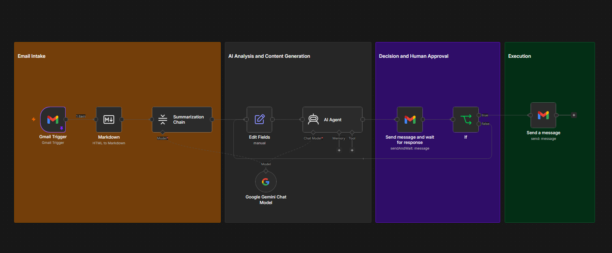
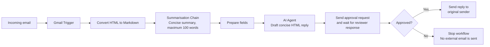

# Gmail Human-in-the-Loop System

An n8n email-automation prototype that generates an AI-assisted reply, pauses for human approval, and sends the response only when it is approved.

## Project Snapshot

| Item | Details |
| --- | --- |
| **Project type** | Human-in-the-loop email automation |
| **Platform** | n8n |
| **Integrations** | Gmail and OpenAI Chat Model |
| **AI model configured** | GPT-4.1 mini |
| **Safeguard** | Generated replies require human approval before they are sent |

## Goal

Use AI to reduce email-drafting effort without allowing an automated system to send an external reply without human judgement.

## Business Problem

AI can help teams respond faster, but fully automated email can introduce errors, inappropriate tone, or inaccurate commitments. This workflow keeps a person in control at the decision point: AI drafts the reply, while a human decides whether it is safe and appropriate to send.

## Solution

The workflow watches an inbox, converts the incoming email content into a usable format, summarises it, and passes that summary to an AI Agent. The AI Agent drafts a concise HTML response. n8n then sends the draft to a designated reviewer using its **send and wait for response** approval mechanism. If the reviewer approves it, the workflow sends the reply to the original sender. If not approved, the workflow stops without sending an external response.

## User Flow

The diagram makes the control point explicit: AI assists with analysis and drafting, but the decision to communicate externally remains with a human reviewer.

## Workflow Logic

### 1. Email intake and preparation

- **Gmail Trigger** detects incoming email.
- **Markdown** converts the email snippet from HTML to Markdown for easier processing.
- **Summarisation Chain** creates a concise summary of the content.

### 2. AI-assisted reply generation

- The **OpenAI Chat Model** supports both the summarisation chain and AI Agent.
- The **AI Agent** is instructed to write a professional business-email reply in HTML, with no subject line and a maximum length of 100 words.

### 3. Human approval and safe execution

- **Send message and wait for response** sends the original email and AI draft to a reviewer and pauses the workflow.
- The **If** node evaluates the approval outcome.
- Approved replies are sent to the original email sender; rejected or unapproved replies do not proceed to sending.

## Requirements Coverage

| Requirement | Implementation |
| --- | --- |
| AI-generated content | Summarisation Chain and AI Agent use an OpenAI Chat Model |
| Human review | The workflow pauses for a reviewer response before sending any reply |
| Decision point | The `If` node branches based on approval status |
| Safe action | Gmail sends a reply only on the approval branch |
| Rejection fallback | The non-approved branch stops without sending an external message |

## My Contribution

- Designed a human-in-the-loop workflow for AI-assisted business-email replies.
- Configured a summarisation step to help the AI focus on the email’s core message.
- Created prompt instructions for concise, professional, HTML-formatted replies.
- Added a reviewer approval gate before outbound email is sent.
- Implemented an approval decision branch to prevent unapproved responses from leaving the system.

## Setup Notes

This is a learning prototype. To run a safe version in your own n8n environment:

1. Connect your own Gmail and OpenAI credentials.
2. Replace the configured reviewer address with an approved internal reviewer or shared mailbox.
3. Test with non-sensitive sample emails.
4. Confirm that both approval and rejection outcomes behave as expected.
5. Keep the workflow in review-first mode; do not remove the approval gate without an appropriate risk assessment.

## Current Scope and Next Steps

The workflow supports a single approval step before sending a reply. Potential improvements include:

- Give reviewers the option to edit the draft before approval.
- Route high-risk topics to a specialist reviewer or multiple approvers.
- Add confidence scoring and automatically escalate low-confidence drafts.
- Record reviewer decisions, reasons for rejection, and turnaround time.
- Add an error-notification path for failed Gmail or AI requests.

## Evidence

- [Annotated workflow screenshot](./assets/gmail-hitl-workflow.png)
- Sanitized n8n workflow export: Available upon request.

---

*Built as part of the Elevate University Productivity Engineer Bootcamp. This is a learning prototype and should be tested, secured, and reviewed before production use.*
