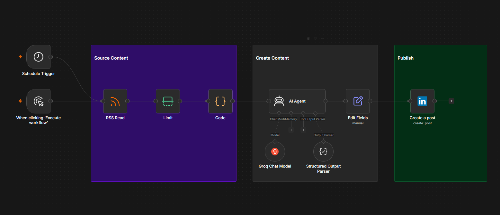
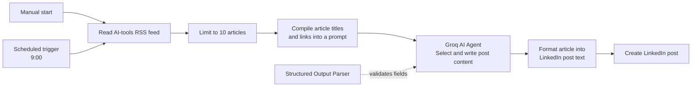

# LinkedIn Post Bot

An n8n content-automation workflow that monitors an AI-news RSS feed, selects a relevant story, turns it into a structured LinkedIn post with a Groq-powered AI Agent, and publishes the result to LinkedIn.

## Project Snapshot

| Item | Details |
| --- | --- |
| **Project type** | AI-assisted social-content automation |
| **Platform** | n8n |
| **Integrations** | RSS feed, Groq Chat Model, LinkedIn |
| **AI model configured** | Llama 3.3 70B Versatile via Groq |
| **Content source** | Google News RSS search for AI tools |
| **Output** | Structured LinkedIn post published through the LinkedIn integration |

## Goal

Turn timely AI-tool news into a consistent LinkedIn content workflow by sourcing relevant articles, generating a readable post, and publishing it through one automated process.

## Business Problem

Creating professional social content consistently requires monitoring relevant news, identifying worthwhile stories, writing in a clear voice, and publishing on schedule. This workflow demonstrates how AI and automation can reduce repetitive content-production work while preserving a structured content format.

## Solution

The workflow can be started manually or on a schedule. It reads recent AI-tool stories from a Google News RSS feed, limits the batch to ten items, and compiles the article titles and links into a prompt. A Groq-powered AI Agent selects the most impactful story and returns structured post content. The workflow formats the result into a single post and sends it to LinkedIn using the LinkedIn integration.

## User Flow

The flow separates sourcing, AI content creation, formatting, and publishing, making each stage easy to inspect and improve.

## Workflow Logic

### 1. Source timely content

- The workflow can be launched through a **Manual Trigger** or a **Schedule Trigger** configured for 9:00.
- **RSS Read** retrieves recent articles from a Google News RSS search for AI tools.
- **Limit** restricts processing to ten stories.
- A **Code** node compiles each article’s title and link into a single research prompt.

### 2. Create structured LinkedIn content

- The **AI Agent**, powered by the **Groq Chat Model**, chooses the most impactful or insightful article.
- The Agent is asked to return a title, opening paragraph, relevant bullet points, closing paragraph, link, and three to five hashtags.
- A **Structured Output Parser** makes the response predictable and easier to format.

### 3. Publish

- **Edit Fields** combines the structured content into a single LinkedIn post.
- **Create a post** sends the resulting text through the configured LinkedIn account.

## My Contribution

- Designed an end-to-end workflow for transforming RSS news into LinkedIn content.
- Connected scheduled and manual triggers to support both routine and on-demand publishing.
- Used RSS filtering and code-based prompt preparation to provide the AI with focused source material.
- Configured a Groq-powered AI Agent to select a relevant story and generate a structured, professional post.
- Added an output parser and formatting step to improve content consistency before publishing.
- Integrated LinkedIn as the final publishing channel.

## Tools Used

| Tool | Purpose |
| --- | --- |
| RSS / Google News | Provides current AI-tools article titles and links |
| n8n | Orchestrates triggers, content processing, and publishing |
| Groq Chat Model | Runs Llama 3.3 70B Versatile for AI content generation |
| Structured Output Parser | Enforces a predictable post-content format |
| LinkedIn | Publishes the completed post |

## Responsible Publishing Note

The supplied workflow publishes directly to LinkedIn after generating the post. For professional use, I recommend inserting a review-and-approval step before **Create a post**. This helps verify the source, factual accuracy, tone, links, hashtags, and compliance with platform rules before publication.

## Setup Notes

To run a safe version of this workflow in your own n8n environment:

1. Connect your own Groq and LinkedIn credentials.
2. Choose an RSS source and search terms relevant to your professional niche.
3. Test outputs manually with sample articles.
4. Add a human approval step before publishing to LinkedIn.
5. Never publish account tokens, credential references, or LinkedIn user identifiers to GitHub.

## Current Scope and Next Steps

The workflow sources AI-tools news, writes structured content, and posts it to LinkedIn. Suggested next improvements:

- Add a human review step that creates a draft rather than publishing immediately.
- Store source links and published-post IDs in a content log to prevent duplicates.
- Add source-quality checks and citations in the draft.
- Add brand-voice examples and a content-calendar theme.
- Track performance metrics to identify topics that resonate with the audience.

## Evidence

- [Annotated workflow screenshot](./assets/linkedin-post-bot-workflow.png)
- Sanitized n8n workflow export: Available upon request.

---

*Built as part of the Elevate University Productivity Engineer Bootcamp. This is a learning prototype and should be tested, secured, and reviewed before production use.*
