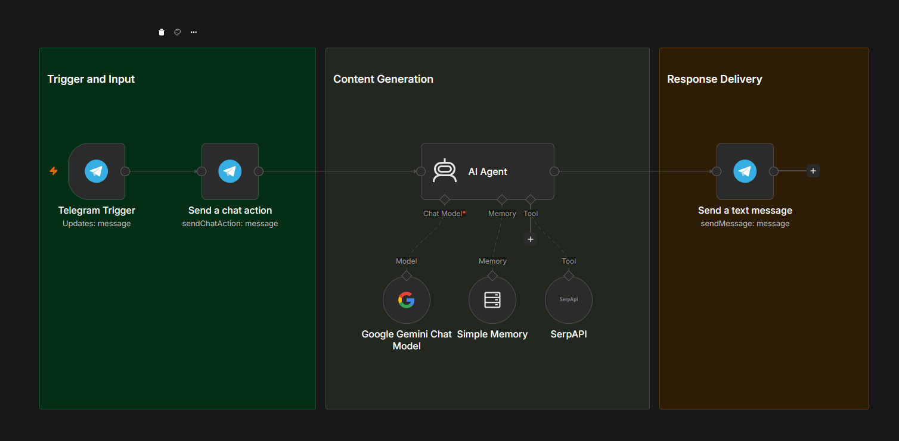
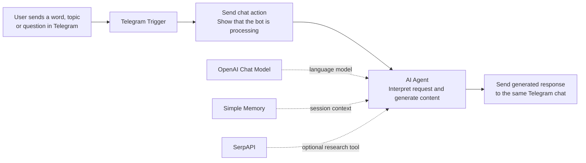

# Telegram Content-Generation Bot

An n8n chatbot that receives a word, topic, or question through Telegram and returns AI-generated content in the same chat.

## Project Snapshot

| Item | Details |
| --- | --- |
| **Project type** | AI-powered chatbot and content-generation automation |
| **Platform** | n8n |
| **Integrations** | Telegram, OpenAI Chat Model, SerpAPI |
| **AI model configured** | GPT-4.1 mini |
| **Input and output** | Telegram message in; AI-generated Telegram message out |

## Goal

Create a simple, accessible content assistant that turns a user-submitted word, topic, or question into a helpful AI-generated response without requiring the user to leave Telegram.

## Solution

The workflow listens for new Telegram messages. Once a message arrives, it sends a chat action to show that the bot is processing the request, then passes the submitted text to an AI Agent. The Agent is configured to respond accurately with a friendly, witty style and can use SerpAPI when research is useful. The completed response is sent back to the same Telegram chat.

## User Flow

The flow shows a direct conversational loop: user input is processed by the AI Agent and returned as a Telegram message, with research support available when needed.

## Workflow Logic

### 1. Receive the request

- **Telegram Trigger** listens for message updates.
- A user can submit a topic, keyword, or question in a Telegram chat.
- **Send a chat action** provides immediate feedback that the bot is working on the request.

### 2. Generate useful content

- The **AI Agent** receives the exact text from the Telegram message.
- The configured **OpenAI Chat Model** generates the response.
- Prompt instructions ask the bot to be helpful, accurate, humorous, and expressive with appropriate emojis.
- **SerpAPI** is available as an optional research tool when the Agent needs up-to-date public information.

### 3. Deliver the response

- The workflow sends the Agent’s output back to the originating Telegram chat.
- The user receives the generated content without changing apps.

## My Contribution

- Built an n8n automation that converts Telegram messages into AI-generated content.
- Connected Telegram input, AI processing, optional research, and Telegram response delivery.
- Configured prompt instructions to balance accuracy with a friendly and engaging tone.
- Added a processing indicator to improve the user experience while the AI generates a reply.
- Added short-term memory capability to the Agent configuration.

## Tools Used

| Tool | Purpose |
| --- | --- |
| Telegram | Receives user prompts and delivers generated responses |
| n8n | Orchestrates the workflow and integrations |
| OpenAI Chat Model | Interprets requests and generates content |
| SerpAPI | Supports public-web research when needed |
| Simple Memory | Provides context within the configured session window |

## Setup Notes

To run this workflow in your own n8n environment:

1. Create a Telegram bot with BotFather and connect your own Telegram credentials in n8n.
2. Connect an OpenAI account and, if desired, a SerpAPI account.
3. Import a **sanitized** workflow export; never publish API keys, bot tokens, or credential IDs.
4. Test with harmless sample prompts before allowing other users to access the bot.
5. Add moderation, rate limiting, and error handling before production use.

## Current Scope and Next Steps

The workflow creates a direct response to each Telegram message. Its memory session key is based on the workflow execution, so it should not be treated as persistent conversation history across separate messages. Possible improvements include:

- Use the Telegram chat ID as the memory session key for intentional multi-turn conversations.
- Add commands such as `/help`, `/summarize`, or `/ideas` to guide user requests.
- Add response safety rules, rate limits, and fallback messages for failed tool calls.
- Let users select a content format, such as a LinkedIn post, caption, email, or article outline.
- Log non-sensitive usage metrics to evaluate response quality and common topics.

## Evidence

- [Annotated workflow screenshot](./assets/telegram-bot-workflow.png)
- Sanitized n8n workflow export: to be added after Telegram, OpenAI, and SerpAPI credential references have been removed.

---

*Built as part of the Elevate University Productivity Engineer Bootcamp. This is a learning prototype and should be tested, secured, and reviewed before production use.*
