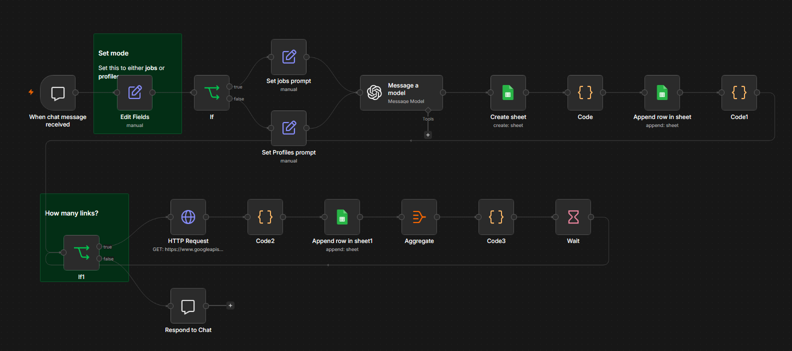
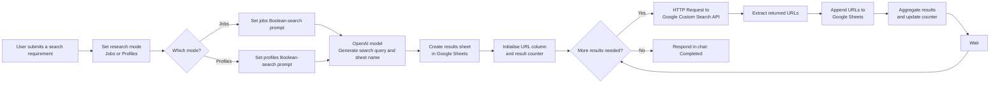

# Professional Profile & Job Research Workflow

An n8n research-workflow prototype that uses AI-generated Boolean search queries and Google Custom Search to discover publicly indexed professional-profile or job-post URLs, then records the results in Google Sheets.

## Project Snapshot

| Item | Details |
| --- | --- |
| **Project type** | AI-assisted public-web research and data-recording workflow |
| **Platform** | n8n |
| **Integrations** | OpenAI, Google Custom Search API via HTTP Request, Google Sheets |
| **Research modes** | Publicly indexed job posts or professional profiles |
| **Output** | A Google Sheet containing discovered result URLs |

## Goal

Make it easier to locate relevant, publicly indexed job posts or professional-profile pages by converting a natural-language requirement into a precise Boolean search query and capturing the result links in a structured sheet.

## Important Scope

Despite its original file name, this workflow does **not** directly scrape LinkedIn. It sends a search query to the Google Custom Search API and collects URLs returned in the search results. It should only be used with approved, lawful data sources and in accordance with Google, LinkedIn, and applicable privacy requirements.

## Solution

A user submits a job description or search requirement through an n8n chat interface. The workflow selects either a Jobs or Profiles search mode, asks an OpenAI model to create a site-restricted Boolean search query and sheet name, then creates a Google Sheet for the result set. It uses an HTTP Request to call Google Custom Search, extracts returned URLs, appends them to the sheet, and repeats the search cycle until the configured result limit is reached.

## User Flow

The flow shows how AI improves search-query design while Google Sheets provides an auditable, structured record of the returned public URLs.

## Workflow Logic

### 1. Select the research mode

- **When chat message received** accepts a user’s job description or search requirement.
- **Edit Fields** sets the search mode.
- The first **If** node routes the workflow to either a job-post prompt or a professional-profile prompt.
- Each prompt directs the model to create a site-restricted Boolean search query for publicly indexed LinkedIn job or profile pages.

### 2. Generate a structured search request

- **Message a model** uses GPT-4o mini to turn the user’s requirement into a Boolean query and a short Google Sheet name.
- **Create sheet** creates a destination sheet for the results.
- An initial code step prepares the `linkedin_url` column.

### 3. Discover and record result URLs

- **HTTP Request** calls the Google Custom Search API with the AI-generated query.
- **Code2** extracts result links from the API response.
- **Append row in sheet1** adds each URL to the created Google Sheet.
- Aggregate, counter, and wait nodes are intended to repeat the request in batches until the target number of links is reached.

## My Contribution

- Designed a chat-driven workflow that translates hiring or research requirements into Boolean search queries.
- Created separate job-post and professional-profile search modes.
- Used OpenAI to generate site-restricted search strings and descriptive result-sheet names.
- Connected an HTTP request to Google Custom Search and processed the returned links with n8n code nodes.
- Built a Google Sheets output process to store, review, and deduplicate discovered URLs.
- Added a batching structure to support collecting multiple result pages rather than a single request.

## Tools Used

| Tool | Purpose |
| --- | --- |
| n8n Chat Trigger | Receives a user’s search requirement |
| OpenAI | Generates Boolean search queries and result-sheet names |
| Google Custom Search API | Returns publicly indexed search results through an HTTP request |
| Google Sheets | Creates and stores the research result set |
| n8n Code nodes | Prepares data, extracts URLs, and manages iteration logic |

## Data, Privacy, and Platform-Use Considerations

- Use only information that is public, lawfully obtained, and necessary for a defined purpose.
- Do not use this workflow to bypass platform controls, collect private profile data, or violate a website’s terms of use.
- Avoid storing unnecessary personal information; this workflow is designed to record result URLs rather than profile details.
- Respect local privacy, recruitment, marketing, and anti-discrimination obligations before using results for outreach or hiring decisions.

## Setup Notes

Before using or sharing a version of this workflow:

1. Create and connect your own OpenAI and Google Sheets credentials.
2. Create your own Google Custom Search Engine and store its API key in n8n credentials or environment variables—not directly in an HTTP Request node.
3. Use test searches with non-sensitive, public data.
4. Set a sensible, documented result limit and add error handling for API quotas or no-result responses.
5. Never publish API keys, credential references, Google Sheet IDs, or private data to GitHub.

## Current Scope and Next Steps

The workflow currently demonstrates the research-to-sheet pattern. Before production use, the iteration and stopping logic needs correction: the supplied export checks whether the counter equals `15` but increments it by `10`, so it does not reliably reach its completion branch. Recommended improvements:

- Use a clear `start < target` condition and a matching page-size increment.
- Let the user choose Jobs or Profiles in the chat rather than relying on a fixed mode field.
- Add duplicate-URL checks and a no-results stopping condition.
- Add API error handling, quota monitoring, and configurable result limits.
- Add a human review step before any downstream recruitment or outreach action.

## Evidence

- [Annotated workflow screenshot](./assets/professional-profile-job-research-workflow.png)
- Sanitized n8n workflow export: to be added only after removing all API keys, account references, Google Sheet identifiers, and other account-specific data.

---

*Built as part of the Elevate University Productivity Engineer Bootcamp. This is a learning prototype using public-web research patterns and requires security, privacy, platform-compliance, and logic review before production use.*
