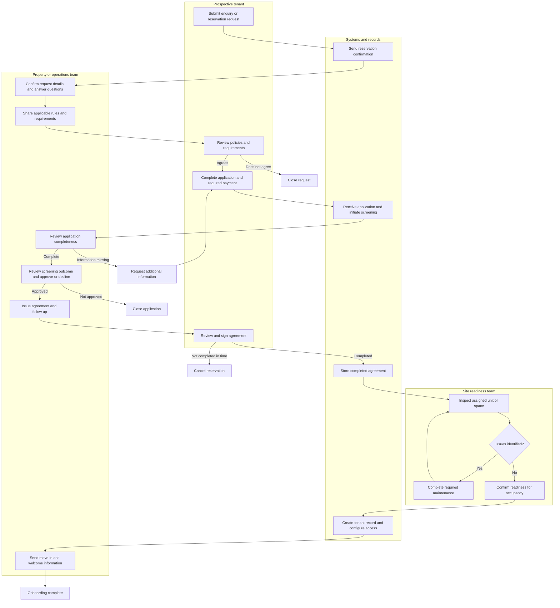

# Tenant Onboarding BPMN Case Study

An anonymized business-process mapping case study that models a multi-stage tenant onboarding journey from initial enquiry through approval, agreement completion, site readiness, and move-in.

> **Confidentiality note:** This repository intentionally contains a high-level, anonymized representation only. Original process maps, source files, organisation-specific terminology, rules, timeframes, systems, and operational thresholds are not included.

## Project Snapshot

| Item | Details |
| --- | --- |
| **Project type** | Business Process Model and Notation (BPMN) case study |
| **Primary focus** | Process mapping, role clarity, hand-offs, decision points, and exception paths |
| **Tool used** | Lucidchart |
| **Process context** | Tenant onboarding for a managed property or site-based operation |
| **Output** | An anonymized current-state process map and improvement observations |

## Goal

Visualise the end-to-end tenant onboarding process so that stakeholders can understand who owns each step, where systems support the process, which decisions affect the outcome, and where follow-up or rework may be required.

## Business Challenge

Tenant onboarding involves multiple people, systems, documents, and approval decisions. Without a shared process map, teams can experience unclear ownership, delayed communication, incomplete applications, repeated follow-up, or a site that is not ready when an approved tenant is due to move in.

## Anonymized Process Overview

This high-level view captures the principal hand-offs and decision points while excluding confidential procedures, approval criteria, and operational rules.

## What the Process Map Covers

- Initial enquiry or reservation request
- Automated acknowledgement and operational follow-up
- Requirement and policy review
- Application submission, completeness checks, and requests for missing information
- Screening and approval or decline outcomes
- Agreement issue, signing, and document storage
- Physical readiness inspection, maintenance exception path, and move-in preparation
- Tenant record creation, access configuration, and welcome communication

## My Contribution

- Analysed a real multi-team onboarding process and translated it into a BPMN-style visual workflow.
- Identified key swimlanes for the tenant, operational team, systems, and site-readiness functions.
- Mapped core hand-offs, system notifications, documents, and operational responsibilities.
- Represented decision points and exception paths, including incomplete information, non-approval, unsigned agreements, and maintenance requirements.
- Produced a shareable process summary that preserves business confidentiality while demonstrating process-analysis capability.

## Skills Demonstrated

| Skill | Application in this case study |
| --- | --- |
| BPMN and process mapping | Visualised an end-to-end workflow with roles, tasks, gateways, and outcomes |
| Stakeholder analysis | Distinguished responsibilities across customer, operations, systems, and site teams |
| Critical thinking | Identified risk points, rework loops, and exception handling |
| Process improvement | Highlighted potential areas for automation, clearer ownership, and readiness checks |
| Lucidchart | Created the original process map and swimlane structure |

## Improvement Opportunities Identified

The original analysis highlights general improvement themes rather than confidential recommendations:

- Use automated acknowledgements and status updates to reduce manual follow-up.
- Make completeness requirements visible before an application is submitted.
- Define clear service ownership for each hand-off between teams.
- Track approval, agreement, and readiness milestones in a shared system.
- Use exception queues for missing information, pending agreements, and maintenance items.
- Ensure site-readiness confirmation occurs before move-in communications are issued.

## Evidence and Confidentiality

The original Lucidchart/PDF map and image are intentionally not published here because they reflect a real operating process. This README is the portfolio-safe evidence of the work: it communicates the problem-solving approach, scope, skills, and anonymized workflow without exposing proprietary details.

---

*Created as part of the Elevate University Productivity Engineer Bootcamp. This is an anonymized process-analysis case study; it does not represent or disclose a specific organisation’s operational procedures.*
