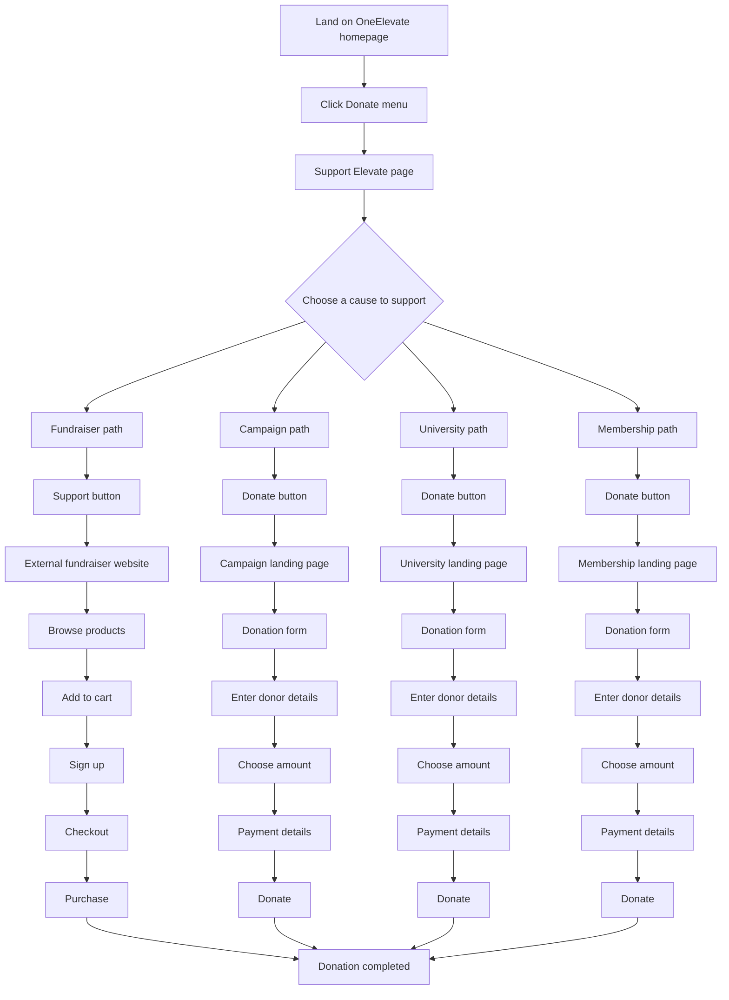
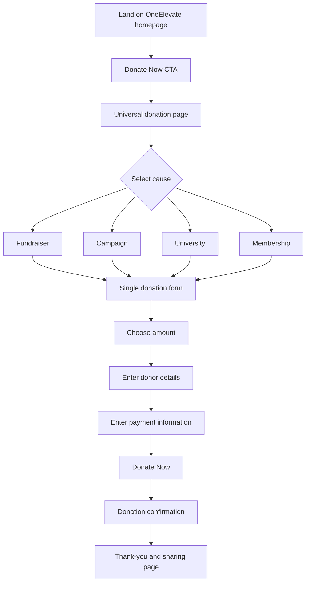

# Donation Journey Redesign

A user-flow analysis and redesign proposal for the OneElevate donation journey. The project maps the current donor experience, identifies friction, and proposes a single, lower-friction donation path.

## Project Snapshot

| Item | Details |
| --- | --- |
| **Project type** | User-flow analysis and experience redesign |
| **Focus** | Donation conversion, usability, and reduced journey complexity |
| **Tool used** | Lucidchart |
| **Deliverables** | Current-state user flow, future-state user flow, and improvement rationale |

## Goal

Reduce the number of steps and disconnected donation experiences a potential donor encounters, while keeping users within a consistent OneElevate journey from intent to confirmation.

## Problem Statement

The original donation journey asked users to choose among multiple causes before they could donate. Each cause followed a different path, including a product-fundraiser path that moved users to an external site. This created inconsistent steps, additional navigation, and an elevated risk of users abandoning the process before completing a donation.

## Current-State User Flow

### Current-State Friction Points

- Multiple pages and transitions before a donor can complete a contribution.
- Four different donation experiences rather than a consistent journey.
- One path redirects users to an external fundraiser site.
- Account creation is required in the external fundraiser path.
- Users must make a cause-selection decision before seeing a universal donation form.
- Additional steps can increase confusion and abandonment risk.

## Proposed Future-State User Flow

## Proposed Design Principles

1. Make **Donate Now** a clear, direct call to action from the homepage.
2. Keep cause selection within a universal donation page instead of sending donors to separate campaign journeys.
3. Use one consistent form, payment experience, confirmation state, and visual language.
4. Keep users within the OneElevate experience wherever possible.
5. Present the donation amount, donor details, and payment fields in a clear, predictable order.
6. End with a confirmation and optional sharing opportunity.

## Expected Impact

| Experience factor | Current state | Proposed future state |
| --- | --- | --- |
| Clicks before donation | Approximately 4–8+ depending on the path | Approximately 2–4 |
| External redirects | Present for one path | Removed from the core journey |
| Account creation | Required in one path | Not required in the universal journey |
| Donation experience | Multiple pathways | One consistent pathway |
| Donor decision load | Higher | Lower |
| Abandonment risk | Higher because of extra steps | Reduced through a shorter, clearer flow |

These are directional UX expectations, not measured conversion results. They should be validated through analytics, user testing, and controlled experimentation.

## My Contribution

- Analysed the existing donation journey and mapped its distinct paths in Lucidchart.
- Identified inconsistent experiences, external redirects, account-creation requirements, and additional decision points as potential friction.
- Created a streamlined future-state user flow centred on a universal donation experience.
- Proposed keeping cause selection, amount selection, donor details, and payment in a single consistent journey.
- Communicated the redesign using clear current-state and future-state process visuals.

## Skills Demonstrated

| Skill | Application |
| --- | --- |
| User-flow design | Mapped user actions and decisions from entry to donation completion |
| UX analysis | Identified friction, navigation complexity, and inconsistent pathways |
| Process improvement | Redesigned the journey around fewer transitions and a single form |
| Critical thinking | Balanced donor choice with lower cognitive load and a clearer conversion path |
| Lucidchart | Created the original current-state and future-state diagrams |

## Recommended Validation Steps

- Review analytics to establish baseline completion and abandonment rates by path.
- Test the universal donation page with representative donors.
- Run accessibility and mobile usability checks on the donation form.
- Confirm payment-provider, donation-designation, tax-receipt, and privacy requirements.
- A/B test the revised journey before a full rollout where feasible.

---

*Created as part of the Elevate University Productivity Engineer Bootcamp. This is a UX analysis and redesign proposal; expected outcomes require validation with real-user data and organisational approval.*
