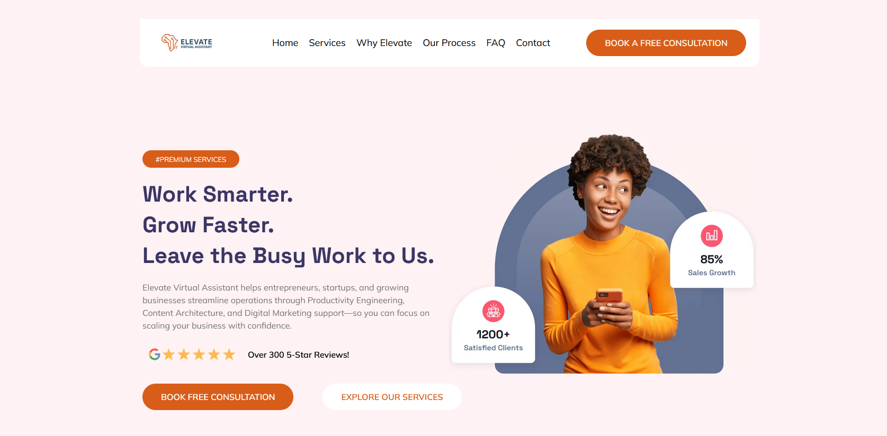
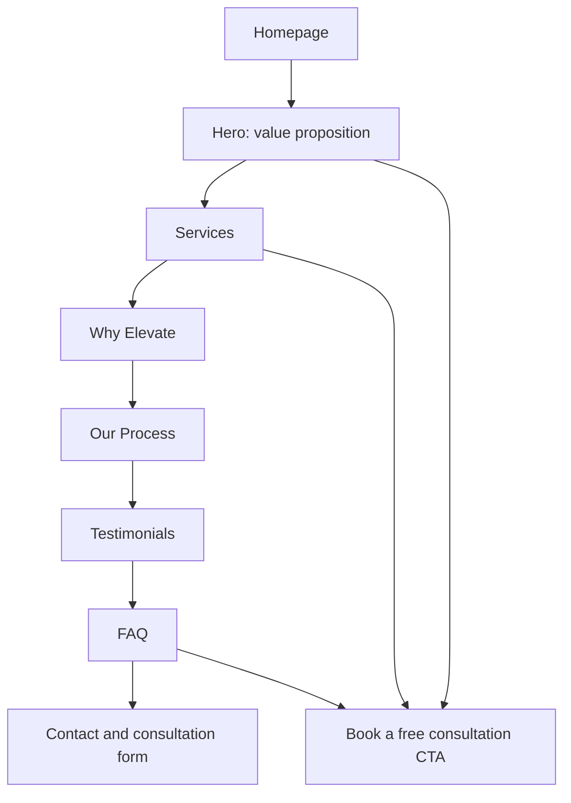

# Elevate Virtual Assistant Website

A responsive marketing website for Elevate Virtual Assistant, designed in the 14forty GoHighLevel site builder to communicate services clearly, support search visibility, and guide prospective clients toward booking a consultation.

## Live Preview

[View the website preview](https://sites.leadconnectorhq.com/preview/Kmnv5NeY7lZoUngQBVqy?notrack=true#section-xMqENxGvLz)

## Project Snapshot

| Item | Details |
| --- | --- |
| **Project type** | Marketing website and lead-generation landing experience |
| **Platform** | 14forty GoHighLevel site builder |
| **Audience** | Entrepreneurs, startups, and growing businesses seeking remote operational support |
| **Primary CTA** | Book a free consultation |
| **Key services presented** | Productivity Engineering, Digital Marketing Operations, and Content Architecture |

## Goal

Build a clean, visually strong website that clearly explains Elevate Virtual Assistant’s offer, supports organic search visibility through structured content, and encourages prospective clients to book a consultation.

## Design Approach

The site uses a conversion-focused one-page structure. It introduces the value proposition immediately, explains services and differentiators, outlines a simple working process, builds trust with testimonials and FAQs, and repeats the consultation call to action at key points in the journey.

## Information Architecture

This structure helps visitors move from understanding the offer to building confidence and taking a clear next step.

## Website Features

### Clear messaging and structure

- A hero section communicates the core promise: helping businesses work smarter, grow faster, and delegate busy work.
- Navigation links make key sections easy to reach: Home, Services, Why Elevate, Our Process, FAQ, and Contact.
- Service content is grouped into Productivity Engineering, Digital Marketing Operations, and Content Architecture.
- A four-step process explains Discovery, Planning, Execution, and Continuous Improvement.

### Lead-generation design

- A prominent **Book a Free Consultation** button appears in the header and throughout the page.
- Calls to action connect visitors to a consultation form.
- Testimonials, service explanations, and FAQs reduce uncertainty before a visitor contacts the business.
- Contact information and social links provide additional trust and contact routes.

### SEO-conscious content design

- The site uses descriptive section headings and clear service-language aligned with virtual-assistant and productivity-support needs.
- It includes structured content for services, process, FAQs, and trust signals that can support search relevance and user comprehension.
- Internal navigation allows visitors and search engines to understand the page’s content hierarchy.

SEO performance requires ongoing technical checks, keyword research, analytics, content updates, and indexing review; it cannot be confirmed from a visual site build alone.

## My Contribution

- Planned and built the website using the 14forty GoHighLevel site builder.
- Created a clear one-page information architecture for service discovery and consultation conversion.
- Developed page messaging for the hero, services, differentiators, process, FAQ, and contact areas.
- Designed a visual hierarchy using a professional layout, brand-consistent colours, imagery, and clear calls to action.
- Integrated a consultation-focused conversion path through the site’s call-to-action buttons and form link.
- Applied SEO-conscious content structure through descriptive headings, relevant service content, and FAQ sections.

## Skills Demonstrated

| Skill | Application |
| --- | --- |
| Website building | Created a complete marketing site in GoHighLevel |
| UX and conversion design | Used clear navigation, CTA placement, trust content, and a logical visitor journey |
| Content strategy | Wrote and structured service, process, FAQ, and value-proposition content |
| SEO fundamentals | Used descriptive headings, content hierarchy, and service-focused copy |
| Brand presentation | Applied a clean, cohesive visual layout for a professional service business |

## Recommended Next Steps

- Connect web analytics and conversion tracking for consultation form submissions.
- Run keyword research and optimise titles, meta descriptions, image alt text, and local-business information.
- Test mobile performance, page speed, accessibility, and form completion flow.
- Review testimonial claims and contact details for accuracy before public launch.
- A/B test hero messaging and CTA wording to improve consultation conversion over time.

---

*Built as part of the Elevate University Productivity Engineer Bootcamp. The site is a portfolio project; SEO and conversion outcomes should be validated through analytics and user testing.*
