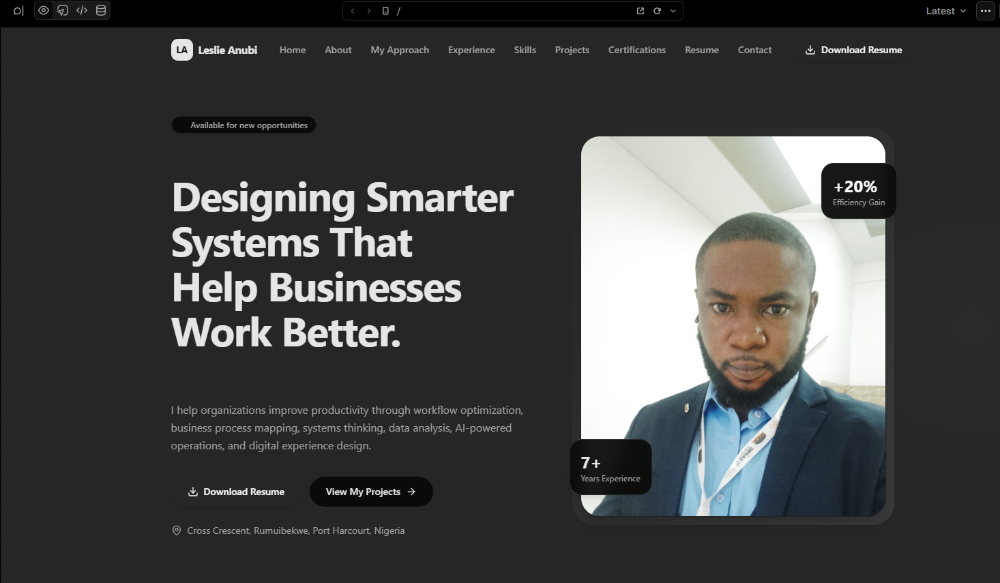
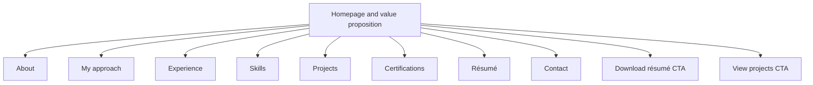

# Personal Productivity Engineer Portfolio

A personal portfolio website built through vibe coding in v0, designed to present my professional identity, skills, experience, project work, certifications, and résumé in one cohesive digital experience.

## Project Reference

[View the v0 project](https://v0.app/leslieanubi-2155s-projects/chat/productivity-engineer-portfolio-kWHo2nRiVGf?ref=AP6Y1G)

> The v0 project link may require sign-in. A separate public deployment URL should be added here once available.

## Project Snapshot

| Item | Details |
| --- | --- |
| **Project type** | Personal portfolio and professional-brand website |
| **Development approach** | Vibe coding with v0 |
| **Version control** | GitHub |
| **Primary audience** | Recruiters, hiring managers, collaborators, and prospective clients |
| **Core content** | Name, professional bio, photograph, résumé, skills, experience, projects, certifications, and contact information |

## Goal

Create a professional online portfolio that makes it easy for employers and collaborators to understand my value proposition, review my work, download my résumé, and contact me about relevant opportunities.

## Design Approach

The homepage uses a strong professional headline, concise value proposition, personal image, and two clear calls to action: download the résumé or view projects. The navigation provides direct access to key career information without forcing visitors to search through a long page.

## Information Architecture

This structure helps a recruiter move quickly from the professional summary to evidence of skills, experience, and completed work.

## Website Features

### Professional identity and positioning

- A prominent hero section communicates a Productivity Engineer focus and systems-improvement value proposition.
- A concise bio describes relevant capability in workflow optimisation, business-process mapping, systems thinking, data analysis, AI-powered operations, and digital-experience design.
- A professional photograph gives the portfolio a personal, credible presence.

### Recruiter-friendly navigation

- Sections for Home, About, My Approach, Experience, Skills, Projects, Certifications, Résumé, and Contact.
- A visible résumé-download button in the navigation and hero section.
- A project call to action that directs visitors toward evidence of practical work.

### Visual design

- A modern dark interface with a focused typographic hierarchy.
- Clear contrast between primary calls to action and supporting navigation.
- A responsive-style hero layout that balances professional copy with a personal visual.

## My Contribution

- Used v0 to create the initial portfolio design and implementation through prompt-led, iterative development.
- Defined the portfolio information architecture around recruiter and hiring-manager needs.
- Created the core page content, including professional headline, bio, skills, project, certification, and résumé sections.
- Integrated a professional photograph and prominent résumé-download call to action.
- Structured the site to highlight projects and make contact information easy to find.
- Used GitHub as the version-control home for portfolio-related project documentation and assets.

## Skills Demonstrated

| Skill | Application |
| --- | --- |
| Vibe coding | Used prompt-led v0 development to rapidly create a professional website interface |
| Personal branding | Communicated a clear professional identity and value proposition |
| UX and information architecture | Organised career information for fast recruiter review |
| Web design fundamentals | Applied hierarchy, navigation, calls to action, and visual consistency |
| GitHub | Organised portfolio documentation and project evidence |

## Recommended Next Steps

- Connect a public deployment URL and custom domain.
- Link every project card to its corresponding GitHub case study.
- Add an accessible downloadable résumé PDF and ensure it remains current.
- Review mobile responsiveness, keyboard navigation, and image alt text.
- Add analytics to understand which projects and CTAs receive the most attention.
- Periodically update experience, certifications, skills, and project outcomes.

---

*Built as part of the Elevate University Productivity Engineer Bootcamp. This portfolio is designed as an evolving professional showcase and should be maintained as projects and career experience grow.*
